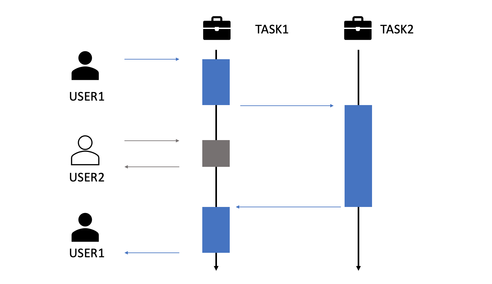

# 非同期処理
## 非同期処理とは？
非同期処理とは、あるタスクを実行している最中に、その処理を止めることなく別のタスクを実行できる方式のこと

### 類義語とその違い
並**行**処理
> 複数の処理を**1つの主体**が切り替えながらこなすこと

並**列**処理
> 複数の処理を**複数の主体**で同時にこなすこと

同期処理
> 複数の処理をこなす際、ある処理が別の処理の終了を待つような処理

非同期処理
> 複数の処理をこなす際、ある処理は別の処理の終了を待たないような処理

### 目的
- 並行処理：処理を「同時に進行させる」ことが目的
- 並列処理：処理を「速くこなすこと」が目的
- 同期処理・非同期処理：別の処理を「待つ必要があるか・ないか」を語ることが目的

### メリット
- 全体の処理速度を速められる（並列処理の側面）
- 快適な操作性を確保する
  - DBアクセスの際、画面ではローディングアニメーションが表示されている etc.

### デメリット
- 現在何の処理を行っているのかなどプログラムの全体像が複雑になる
  - 同期処理の場合は基本的に上から順番に実行される
  - （順序を気にする）非同期処理を扱う場合、開発者が順序を制御しなければならない

### 参照
- [非同期処理とは？ 同期処理との違い、実装方法について解説](https://www.rworks.jp/system/system-column/sys-entry/21730)
- [並行処理、並列処理、同期処理・非同期処理についてまとめ](https://qiita.com/kyabetsuda/items/384a57ff6b7250de40ad)