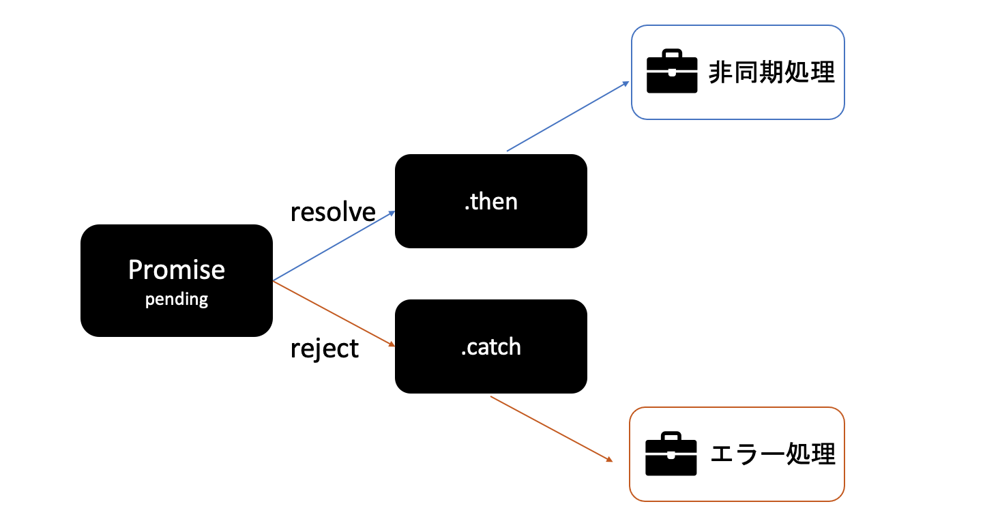

# 非同期処理 in JavaScript【Promise】

### はじめに
[2023/08/11 非同期処理](./11_Async_Process.mdx)から続きで、JSではどのように記述していくのかを本記事ではまとめます。<br/>
「JSは簡単」とよく見かけるのですが、Promise型はかなり難しいと思っております。😓<br/>
実務で（苦しみながら）使うようになり、最近ある程度理解してきたかな？というタイミングなので、復習がてらまとめていこうと思います。

## Promiseとは
Promise型とは、処理の順序に**約束**を取り付けるためのデータ型<br/>
約束をすることで**非同期処理の整理・制御**をすることができる。
> 非同期処理とは、あるタスクを実行している最中に、その処理を止めることなく別のタスクを実行できる方式のこと。

つまり、非同期処理はいくつものタスク並列で走らせ、順番もグチャグチャな「カオス」を作り出す<br/>
そのカオスを防ぐために考えられたのが、Promise型といえる。

人は約束を「**結び**」「**守り**」「**破り**」ます。それにより、安心したり、計画通りにいったり、怒ったりします。<br/>
→ Promiseには状態がある<br/>
→ Promiseの状態に応じて処理を待ったり、処理を変更することができる

### Promiseの3つ状態
Promiseには、`PromiseStatus`というstatusがあり、3つのstatusがある。

- `pending`: 未解決 (処理が終わるのを待っている状態)
- `fulfilled`: 解決済み (処理が終わり、無事成功した状態)
- `rejected`: 拒否 (処理が失敗に終わってしまった状態)



`new Promise()`で作られたPromiseオブジェクトは、`pendeing`という`PromiseStatus`で作られる。<br/>
処理が成功した時に、`PromiseStatus`は`fulfilled`に変わり,`then`に書かれた処理が実行される。<br/>
処理が失敗した時は、`PromiseStatus`が`rejected`に変わり、`catch`に書かれた処理が実行される。

### 基本的なPromise使い方

```js filename="Promiseの構文"
/** 0. 構文 */
new Promise((resolve, reject) => {
  //同期処理
}).then(resolvedValue => {
  // resolveされた場合
  // 非同期処理
}).catch(rejectedValue => {
  // rejectされた場合
  // 非同期処理
}).finally(() => {
  // 必ず発生
  // 非同期処理
})

/** 1. インスタンス化 */
const goToOffice = new Promise() // promiseStatus = pending
```

```js
/** 2. 引数にコールバック関数: statusを変更する
 * statusを解決させるか・拒否するか
 * コールバック関数の引数にresolve関数, reject関数
 * 状態遷移させるまでは同期処理 
*/
const goToOffice = new Promise((resolve, reject) => {}) // promiseStatus = pending
```

```js
/** 3. resolve() → .thenに遷移 */
const goToOffice = new Promise((resolve, reject) => {
  console.log("朝9時に来てね");
  const answer = "10分前につきました!"
  resolve(answer); // .thenのコールバック関数の引数に渡せる
})
  .then(answer => {
    console.log(`${answer}か、まあ当然だよね`);
  }); // promiseStatus = resolved
```

```js
/** 4. reject() → .catchに遷移 */
const goToOffice = new Promise((resolve, reject) => {
  console.log("朝9時に来てね");
  const answer = "テレワークします！"
  reject(answer); // .catchのコールバック関数の引数に渡せる
}) // promiseStatus = rejected
  .then(answer => {
    console.log(`${answer}か、まあ当然だよね`); // 実行されない
  })
  .catch(answer => {
    console.log(`${answer}？あなたはサボるのでダメです`);
  }) // promiseStatus = resolved (rejectされたものがcatchされ、無事処理を終えresolveされた。)
```

```js
/** 5. .catch → .thenも可能 */
const goToOffice = new Promise((resolve, reject) => {
  console.log("朝9時に来てね");
  const answer = "テレワークします！"
  reject(answer); // .catchのコールバック関数の引数に渡せる
}) // promiseStatus = rejected
  .then(answer => {
    console.log(`${answer}か、まあ当然だよね`); // 実行されない
  })
  .catch(answer => {
    console.log(`${answer}？あなたはサボるのでダメです`);
  })
  .then(answer => { // answerを使いたい場合、.catch内でreturnする
    console.log('この処理はつづくよ');
  });
```

### 参照
[【ES6】 JavaScript初心者でもわかるPromise講座](https://qiita.com/cheez921/items/41b744e4e002b966391a)