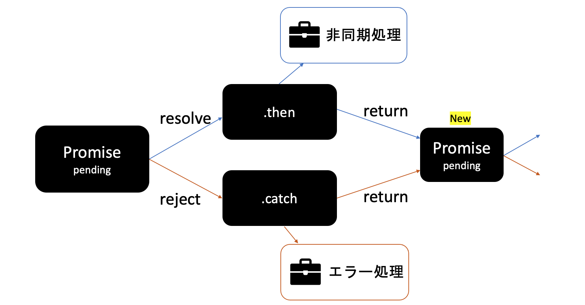

# 非同期処理③

### なぜPromise？【コールバックヘル】
- コールバック関数で非同期処理を連鎖させると、階層が深くなる（コールバックヘル）
```js filename="1秒ごとに(時間経過-1秒)を表示させる"
function sleep(callback, n) {
  //setTimeOut=非同期API コールバック関数をタスクキューに退避させる関数(n秒後に実行を試みる)
  setTimeout(function () { 
    console.log(n);
    n++
    callback(n);
  }, 1000);
}

sleep(function (n) {// 0秒時点:呼び出し 1秒時点: 0を表示
  sleep(function (n) {// 1秒時点: 呼び出し, 2秒時点: 1を表示
    sleep(function (n) {
      sleep(function (n) {
        sleep(function (n) {
          sleep(function (n) {
          }, n);
        }, n);
      }, n);
    }, n);
  }, n);
}, 0);
```

- Promiseで書き換える（階層が深くならず、可読性が上がる）
```js
function sleep(n) {
  return new Promise(resolve => {
    setTimeout(function () { 
      console.log(n);
      n++
      resolve(n)
    }, 1000);
  })
}

sleep(0)
  .then(n => {
    return sleep(n); // chainさせるには、コールバック関数でPromiseインスタンスを返す
  })
  .then(n => {
    return sleep(n);
  })
  .then(n => {
    return sleep(n);
  })
  .then(n => {
    return sleep(n);
  })
  .then(n => {
    return sleep(n);
  })
```

```js
// アロー関数の記法を利用して以下でも実行可能
sleep(0)
  .then(n => sleep(n))
  .then(n => sleep(n))
  .then(n => sleep(n))
  .then(n => sleep(n))
  .then(n => sleep(n));
```
### プロミスチェーン ↑
- .then関数内のコールバック関数で、Promise**インスタンス**をreturnする
- →新たにPromiseをpending状態で始める
- →Promiseが鎖状につながり非同期処理の順序を制御することが可能



### 非同期処理の順序を観察する
- コールバックの実行順は**受け取る側の問題**
  - setTimeoutのコールバックはマクロタスクキューに投げられ（マイクロキューが空の場合に1つずつ実行）
  - Promiseのコールバックはマイクロタスクキューに投げられる（コールスタックが空になったらすべてのタスクが実行される）
  - 前のマクロタスクにより、マイクロタスクが追加された場合、そのマイクロタスクが先に実行される
```js filename="whenExecCallback.js"
const myFunc = ([order, pattern, funcName]) => {
  console.log(`👻 ${order} This line is ${pattern} executed by ${funcName}`);
};

const syncCall = (callback, order) => {
  callback([order, "Synchronously", syncCall.name]);
};
const asyncAPICall = (callback, order) => {
  setTimeout(callback, 1000, [order, "Asynchronously", asyncAPICall.name])
};
const thenCall = (callback, order) => {
  return Promise.resolve([order, "Asynchronously", thenCall.name])
    .then(callback);
};

console.log("🦖 [1] MAINLINE: Sync");
asyncAPICall(myFunc, "[7]");
console.log("🦖 [2] MAINLINE: Sync");
thenCall(myFunc, "[6]");
console.log("🦖 [3] MAINLINE: Sync");
syncCall(myFunc, "[4]");
console.log("🦖 [5] MAINLINE: Sync");
```

```shell
🦖 [1] MAINLINE: Sync
🦖 [2] MAINLINE: Sync
🦖 [3] MAINLINE: Sync
👻 [4] This line is Synchronously executed by syncCall
🦖 [5] MAINLINE: Sync
👻 [6] This line is Asynchronously executed by thenCall
👻 [7] This line is Asynchrouously executed by asyncAPICall
```

### 参照
- https://zenn.dev/tana0102/articles/5a73971ad05c92
- https://qiita.com/sho_U/items/ff82aa576837198097ce