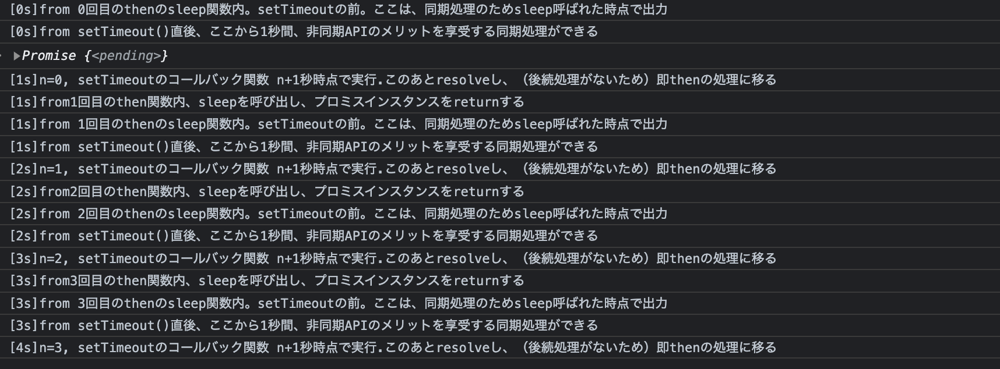

# 非同期処理④
### はじめに
[2023/08/13 非同期処理③](./13_Promise2.mdx)の非同期処理の実行順序に関して、
コールスタックという言葉を平然と使っていたのでそのへんの整理をできたらなと思います。（次回タスクキューについて）

### 非同期処理は並列処理ではない
基本的にJSは、シングルスレッド（メインスレッドのみ）で並列処理はできない
- メインスレッドが占有されている(処理中の)場合、他の処理は実行できない
  - =ネットワークを介した重い処理などを行う場合、その時間だけアプリケーションがフリーズすることとなる（ブロッキング）
  - そこで非同期処理が考えられた
- メインスレッドはコールスタックにより管理される
  - 関数が呼び出されると、コールスタックに積み上がる
  - 関数がreturnされると、コールスタックから追い出される
  - 非同期処理はタスクをコールスタックから一時退避させることで、同時にタスクを処理させているように見せかけている
    - 実際にネットワーク通信や"他の環境"が処理を行うことで、効率的に**並行**処理を行っている

> setTimeout関数といった、非同期APIはコールスタックから条件付きでタスク追い出しているといえる。
タスクを追い出すと何が嬉しいのか？
例えば、DBサーバからJSONデータを取得する処理A(5秒), B(3秒)を考える。
同期処理ではデータ取得に少なくとも8秒かかるが、
Aを非同期APIで要求し、0.1秒後にBを非同期APIで要求した場合、約5.1秒でデータを取得できる。
さらにその５秒間、同期処理を実行できる。


### 前回の1秒ごとにログ出力するPromiseチェーンにコメントをつけてみた
- キモはsetTimeoutにより1s間コールスタックが空になり、この間、同期処理させることが可能な点
  - 今回はsetTimeoutのあとのconsole.logが非同期のメリットを得ている
- setTimeOutのコールバック関数内でresolveしているためPromiseインスタンスの`status=pending`が1s間続いていること
  - この間.thenに遷移することはないため非同期処理を可読性を保ったまま順序制御できている

```js
function sleep(n) {
  return new Promise(resolve => {
    console.log(`[${n}s]from ${n}回目のthenのsleep関数内。setTimeoutの前。ここは、同期処理のためsleep呼ばれた時点で出力`);
    setTimeout(function () { 
      console.log(`[${n+1}s]n=${n}, setTimeoutのコールバック関数 n+1秒時点で実行.このあとresolveし、後続処理後thenの処理に移る`);
      n++
      resolve(n)
    }, 1000);
    console.log(`[${n}s]from setTimeout()直後、ここから1秒間、非同期APIのメリットを享受する同期処理ができる`);
  })
}


sleep(0)
  .then(n => {
    console.log(`[${n}s]from${n}回目のthen関数内、sleepを呼び出し、プロミスインスタンスをreturnする`);
    return sleep(n);
  })
  .then(n => {
    console.log(`[${n}s]from${n}回目のthen関数内、sleepを呼び出し、プロミスインスタンスをreturnする`);
    return sleep(n);
  })
  .then(n => {
    console.log(`[${n}s]from${n}回目のthen関数内、sleepを呼び出し、プロミスインスタンスをreturnする`);
    return sleep(n);
  })

```

出力結果
