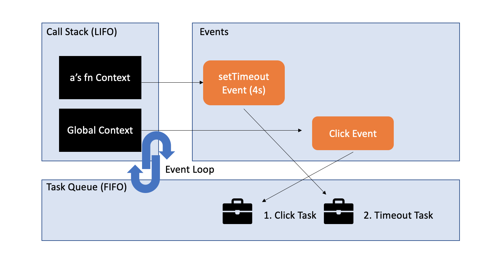

# 非同期処理⑤

### タスクキュー
- 実行待ちの非同期処理の行列
- 非同期処理の実行順を管理
- キューはFIFO(First In First Out)=入ってきた順に実行される
- コールスタックと連携してコードの実行順を決定している
- イベントループがコールスタックを監視し、空になったときにタスクキューからタスクを持ってくる



```js
const btn = document.querySelector('button');
btn.addEventListener('click', () => {
  console.log('click task done');
});

const a = () => {
  setTimeout(() => {
    console.log('timeout task done');
  }, 4000);

  // コールスタックを占有する処理
  const startTime = new Date();
  while(new Date() - startTime() < 2000);

  console.log('fn a done');
}
```
```console
> fn a done
> btn task done
> timeout task done
```

1. グローバルコンテキストがコールスタックに積まれる
2. クリックイベントが登録される
3. a関数コンテキストがコールスタックに積まれる
4. setTimeoutを実行、timeout task(コールバック関数)は4秒待機
5. 5秒間コールスタックが占有される
6. 5秒の間に(4sまでに)ボタンをクリックすると、タスクキューにbtn taskが登録
7. 4秒後timeoutタスクが、タスクキューに登録
7. 5秒の待機が終了、関数aがコールスタックから除かれる
8. グローバルコンテキストがコールスタックから除かれる
9. コールスタックが空になったため、btnタスクが積まれ、実行、除かれる
10. コールスタックが空になったため、timeoutタスクが積まれ、実行、除かれる

