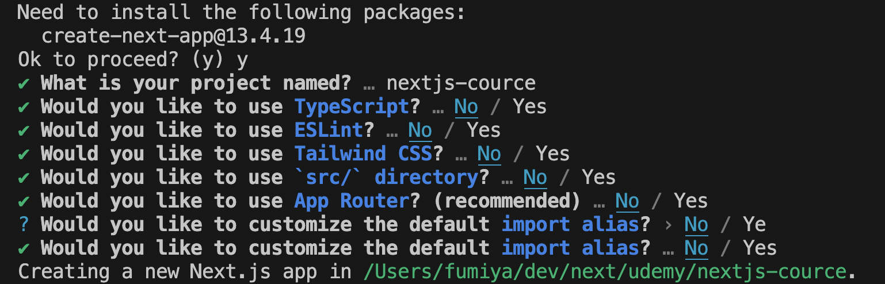

# Next.jsを始める

### create-next-app
※npmが入っていない場合は、[Node.js](https://nodejs.org/ja)からNodeをインストール
```shell
$ npx create-next-app@latest
```
パッケージをインストールするか聞かれる（とりあえず今回は全部No）



### ※App Routerについて
- 上の画像ではApp Routerを使うことが推奨されている
- これはPage Routerの代替方法
- App RouterはServer Actions機能が搭載されている
  - GET以外のPOST, PUT, PATCHリクエストをNext使う機能
  - 13.4時点ではα版でバグがあるかもしれない

### Projectフォルダを分析する
root直下にはnode_modules, pages, public, stylesフォルダがある。

- node_moduls
  - 依存関係パッケージが保存されている
  - `git clone`などで持ってきたり、パッケージが更新がされたなら`npm install`を実行する必要がある
- public
  - 基本的にimgなど共通的に使いたい静的ファイルが入る
  - React App ではindex.htmlが入っているが、Nextにはない
  - Nextは動的にSPAをプリレンダリングするため(リクエストがあったときに初期ページを返す)
- pages
  - File-based Routingを設定する場所
  - このディレクトリ構造がURLに反映され、ルーティングされる

### アプリを起動する
- `npm run dev`で開発サーバを起動できる
- これは`package.json`のscriptsにかかれているコマンド
- 開発サーバでは、ファイル更新を感知して、自動でリロードしてくれる
- `npm run build` はデプロイの準備ができたら本番環境用に最適化された出力を生成する
- `npm run start`はbuild後にNode.jsベースの実サーバーで実行する
- ポートを変更したい場合は`npx next dev -p 3001`

```json
{
  "name": "nextjs-cource",
  "version": "0.1.0",
  "private": true,
  "scripts": {
    "dev": "next dev",
    "build": "next build",
    "start": "next start",
    "lint": "next lint"
  },
  "dependencies": {
    "next": "13.4.19",
    "react": "18.2.0",
    "react-dom": "18.2.0"
  }
}
```


