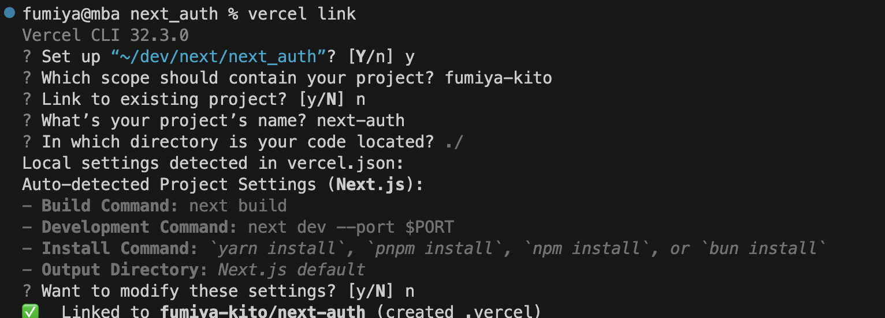

# Vercel Postgres

## はじめに
[【新機能】Vercel Postgres + Next.js + PrismaでフルスタックWebアプリケーションを作ってみた](https://zenn.dev/msy/articles/8d991c79b739aa)
と[公式Docs](https://vercel.com/docs/storage/vercel-postgres/using-an-orm#prisma)
を参考に前回までのNextAuthを使ったアプリもDBをドッカーからVercelPostgresに移行する

## vercel CLIの導入

```shell
pnpm i -g vercel
```
```shell
pnpm i -g vercel@latest
```
```shell
vercel --version
```


## Vercel Postgresのセットアップ
ダッシュボードからstorageの設定をしていく
1. Postgresを選択
2. 名前`next-auth-vercel-postgres`とリージョン`Singapore - (sin1)`の指定
3. create


## Vercel Postgresをプロジェクトに紐付ける
`vercel link`をつかってローカルプロジェクトに紐付ける



## 環境変数をローカルにpullする

- 公式では、.env.development.localでファイルを作成していますが、Prismaの環境変数の都合上、.envファイルを作成させていただきます。

```shell
vercel env pull .env
```
このコマンドを実行すると、ローカルのプロジェクトに.envファイルが作成されます。また以下のようにいくつかの環境変数が記述されています。

```shell filename=".env"
# Created by Vercel CLI
NX_DAEMON=""
TURBO_REMOTE_ONLY=""
TURBO_RUN_SUMMARY=""
VERCEL="1"
VERCEL_ENV="development"
VERCEL_GIT_COMMIT_AUTHOR_LOGIN=""
VERCEL_GIT_COMMIT_AUTHOR_NAME=""
VERCEL_GIT_COMMIT_MESSAGE=""
VERCEL_GIT_COMMIT_REF=""
VERCEL_GIT_COMMIT_SHA=""
VERCEL_GIT_PREVIOUS_SHA=""
VERCEL_GIT_PROVIDER=""
VERCEL_GIT_PULL_REQUEST_ID=""
VERCEL_GIT_REPO_ID=""
VERCEL_GIT_REPO_OWNER=""
VERCEL_GIT_REPO_SLUG=""
VERCEL_URL=""

# Vercel ダッシュボードからコピー
POSTGRES_URL="******"
POSTGRES_PRISMA_URL="*****"
POSTGRES_URL_NON_POOLING="******"
POSTGRES_USER="******"
POSTGRES_HOST="******"
POSTGRES_PASSWORD="**********"
POSTGRES_DATABASE="********"

# アプリ設定
NEXTAUTH_SECRET=NEXTAUTH_SECRET
# NEXTAUTH_URL="******"   Vercelデプロイの場合不要
GOOGLE_CLIENT_ID="********"
GOOGLE_CLIENT_SECRET="**********"
```

## Prismaセットアップ
```prisma filename="schema.prisma"
generator client {
  provider = "prisma-client-js"
}

datasource db {
  provider = "postgresql"
  url = env("POSTGRES_PRISMA_URL") // uses connection pooling
  directUrl = env("POSTGRES_URL_NON_POOLING") // uses a direct connection
  shadowDatabaseUrl = env("POSTGRES_URL_NON_POOLING") 
}

model User {
  id String @id @default(uuid())
  name String?
  email String? @unique
  emailVerified DateTime?
  image String?
  hashedPassword String?
  createdAt DateTime @default(now())
  updatedAt DateTime @updatedAt
  accounts Account[]
}

model Account {
  id String @id @default(uuid())
  userId String
  type String
  provider String
  providerAccountId String
  refresh_token String?
  access_token String?
  expires_at Int?
  token_type String?
  scope String?
  id_token String?
  session_state String?
  user User @relation(fields: [userId], references: [id], onDelete: Cascade)

  @@unique([provider, providerAccountId])
}

```


- migration

```shell
$ npx prisma generate
```

## デプロイ
ここから実際にアプリケーションをデプロイしていきます。
基本的には普段通りのVercelデプロイと何ら変わりはありませんが、今回はORMとしてPrismaを採用しているため、ビルド時にprisma generateを実行する必要があります。
```json filename="package.json"
...

 "scripts": {
    "dev": "next dev",
    "build": "prisma generate && prisma db push && next build",
    "start": "next start",
    "lint": "next lint"
  },

...
```

## Google認証でエラー
- `OAuth 400: redirect_uri_mismatch`
- GCP > APIとサービス > 認証情報 > OAuth2.0クライアントID > 承認済みのリダイレクト
- にデプロイ先URIを指定する（有効になるまで時間かかるらしい）

