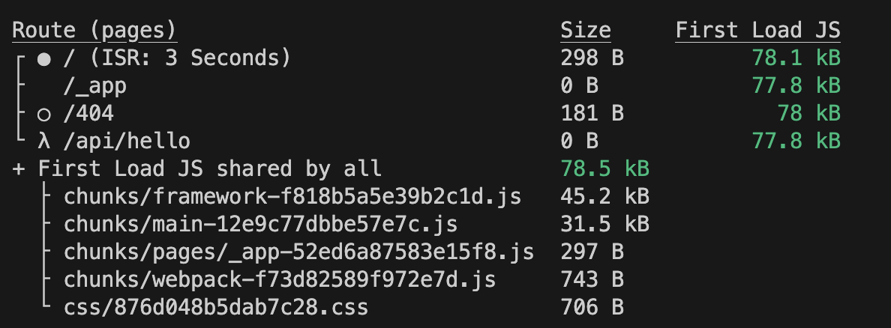
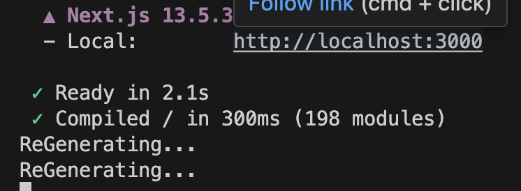

# Page Pre-Rendering4 【Next.js】


## Incremental Static ReGeneration(ISR)を活用する

- SSGではデプロイ前にbuildすることでページを生成していた
- 頻繁にデータが変わる場合、SSGでは毎回デプロイしなければいけなくなる(例えば、ECにおいて商品を追加したときなど)

Nextでは2つの解決策がある
1. 事前ビルドはするが、ReactでAPIを用いてデータフェッチングをする

一度静的に読み込むが、データ更新されていれば`useEffect`で最新データをとってくる

2. incremental static regeneration(ISR)

リクエストがあった際に、SG や ISG によって生成された静的ページを revalidate(秒) に指定した秒数経過ごとに最新の内容へ更新する手法

```jsx filename="pages/index.js"
import path from 'path';
import fs from 'fs/promises';

const Homepage = (props) => {
  const { products } = props;
  return (
    <ul>
      {products.map(product => <li key={product.id}>{product.title}</li>)}
    </ul>
  )
}


export async function getStaticProps() {
  const filePath = path.join(process.cwd(), 'data', 'dummy-backend.json');
  const jsonData = await fs.readFile(filePath);
  const data = JSON.parse(jsonData)

  return {
    props: {
      products: data.products
    },
    revalidate: 10
  }
}

export default Homepage;
```

### ISG (Incremental Static Generation)

- 初回リクエスト時にはSSRで完全なHTMLを生成しクライアントに返却（キャッシュもする）
- 2回目以降のリクエスト時にはキャッシュを表示する
- getStaticPaths の返り値で fallback オプション を blocking や true に設定することで利用可能


## ISRの舞台裏
- `npm run build`するとSSGで作成したページ(白丸)にSSRの`revalidate`時間が保持されている



```js filename="page/index.js"
import path from 'path';
import fs from 'fs/promises';

const Homepage = (props) => {
  const { products } = props;
  return (
    <ul>
      {products.map(product => <li key={product.id}>{product.title}</li>)}
    </ul>
  )
}


export async function getStaticProps() {
  console.log('ReGenerating...');
  const filePath = path.join(process.cwd(), 'data', 'dummy-backend.json');
  const jsonData = await fs.readFile(filePath);
  const data = JSON.parse(jsonData)

  return {
    props: {
      products: data.products
    },
    revalidate: 3
  }
}

export default Homepage;
```

- `npm run start`するとサーバー(今回:ローカルPC)のコンソールに3秒以上経つごとに再読みすると出力される



- **これは、リクエストごとにサーバー上で`getStaticProps`関数が実行されたことを示す**
- データ変更の際に再デプロイは必要ない