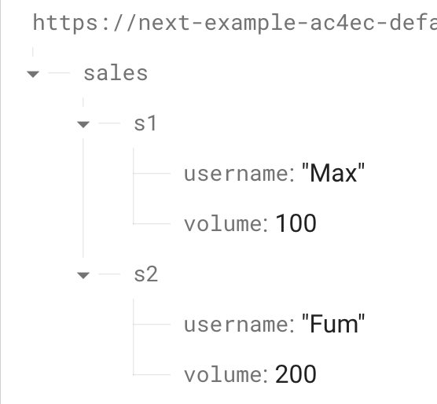

# Page Pre-Rendering10 【Next.js】

## Introducing Client-Side Data Fetching (And When To Use It)
- これまで、Next.jsにおけるSSG(ISG, ISRも)とSSRの使い方と使い時を学んできた
- プリレンダリングする必要のないデータやできないデータに対応するためには標準Reactのようにクライアント側でレンダリング(CSR)する
- クライアント側からAPIでデータを取得する
- 以下のようなケースはローディングスピナーを使用して毎回クライアント側から問い合わせるべきである
1. 毎秒のような頻度で更新されるデータ(在庫数など)
2. ユーザー固有のデータ(注文履歴、ユーザープロフィール) → クローラーは興味ないし、UXも重要ではない、1秒待たせればよい
3. 部分的なデータ(例えば、ダッシュボード画面では多様なデータがあり、より動的なデータはCSRにする)


## Implementing Client-Side Data Fetching
- `last-sale.js`をつくり、CSRのデモを行う
- backendは[firebase](https://console.firebase.google.com/)を使う、new ProjectでRealtime-databaseを作成
- test modeで起動し, 以下の画像のようにデータを用意する


- `useEffect` でAPIを叩いてデータフェッチングをする
- fetch APIのURLでは`URL/sales.json`のようにノードを指定して+`.json`で取得できる
- useEffectの第一引数はクリーンアップ関数でありasync関数には指定できないため、クリーンアップ関数内で即時実行している
- Nextのデフォルトではページ事前生成をするため、useEffect実行前の`<p>NoData</p>`が最初に渡される
```js filename="pages/last-sales.js"
import { useEffect, useState } from "react";

function LastSalesPage(props) {
  const [sales, setSales] = useState([]);
  const [isLoading, setIsLoading] = useState(false);

  useEffect(() => {
    (async() => {
      setIsLoading(true);
    
      const response = await fetch(
        "https://next-example-ac4ec-default-rtdb.asia-southeast1.firebasedatabase.app/sales.json"
      );
      const data = await response.json();
    
      const transformedSales = [];
      for (const key in data) {
        transformedSales.push({
          id: key,
          username: data[key].username,
          volume: data[key].volume,
        });
      }
    
      setSales(transformedSales);
      setIsLoading(false);
      
    })();
  }, []);

  if (isLoading) {
    return <p>Loading...</p>
  }

  if (!sales) {
    return <p>No Data</p>
  }

  return <ul>{sales.map(sale => <li id={sale.id}>{sale.username} - ${sale.volume}</li>)}</ul>;
}

export default LastSalesPage;

```

## Using the "useSWR" NextJS Hook
- Next.jsチームが作成したデータフェッチング用のReactHookに`useSWR`(stale-while-revalidate)がある
- fetchAPIを使用したHTTPリクエストを送信するが、キャッシングとエラー時のバリデーションの再試行などが組み込まれている
- useEffect内の処理を簡潔にしてくれる
```js filename="用法"
useSWR(<request-url>, (url) => fetch(url).then(res => res.json()));
```

- install
```shell
npm install swr
```

- jsonをjsオブジェクトに変換するところまではやってくれるが、transformをどのようにするか？
- これはdataを依存関係とするuseEffectで変換するしかない
- エラーハンドリングの簡単さとフォーカスを失ったときの自動でデータの再取得をしてくれるというメリットが有る
```js filename="pages/last-sales.js"
import { useEffect, useState } from "react";
import useSWR from "swr";

function LastSalesPage(props) {
  const [sales, setSales] = useState([]);
  // const [isLoading, setIsLoading] = useState(false);

  const { data, error } = useSWR(
    "https://next-example-ac4ec-default-rtdb.asia-southeast1.firebasedatabase.app/sales.json",
    (url) => fetch(url).then(res => res.json())
  );
  useEffect(() => {
    if (data) {
      const transformedSales = [];
      for (const key in data) {
        transformedSales.push({
          id: key,
          username: data[key].username,
          volume: data[key].volume,
        });
      }

      setSales(transformedSales);
    }
  }, [data]);

  // useEffect(() => {
  //   (async() => {
  //     setIsLoading(true);
  //     const response = await fetch(
  //       "https://next-example-ac4ec-default-rtdb.asia-southeast1.firebasedatabase.app/sales.json"
  //     );
  //     const data = await response.json();
  //     const transformedSales = [];
  //     for (const key in data) {
  //       transformedSales.push({
  //         id: key,
  //         username: data[key].username,
  //         volume: data[key].volume,
  //       });
  //     }
  //     setSales(transformedSales);
  //     setIsLoading(false);
  //   })();
  // }, []);

  if (error) {
    return <p>Failed to load.</p>;
  }

  if (!data || !sales) {
    return <p>Loading...</p>;
  }

  return (
    <ul>
      {sales.map((sale) => (
        <li id={sale.id}>
          {sale.username} - ${sale.volume}
        </li>
      ))}
    </ul>
  );
}

export default LastSalesPage;
```

##  Combining Pre-Fetching With Client-Side Fetching
- CSRとSSGを組み合わせる
- SSGで事前生成したpropsをsalesのStateの初期値として使う
- そうすることで、最初の読込み時にもデータがある状態でレンダリングされる
- また、DBが更新された際にSWRのおかげで自動的に最新情報がCSRによってレンダリングされる
```js
import { useEffect, useState } from "react";
import useSWR from "swr";

function LastSalesPage(props) {
  const [sales, setSales] = useState(props.sales);
  // const [isLoading, setIsLoading] = useState(false);

  const { data, error } = useSWR(
    "https://next-example-ac4ec-default-rtdb.asia-southeast1.firebasedatabase.app/sales.json",
    (url) => fetch(url).then((res) => res.json())
  );
  useEffect(() => {
    if (data) {
      const transformedSales = [];
      for (const key in data) {
        transformedSales.push({
          id: key,
          username: data[key].username,
          volume: data[key].volume,
        });
      }

      setSales(transformedSales);
    }
  }, [data]);

  if (error) {
    return <p>Failed to load.</p>;
  }

  if (!data && !sales) {
    return <p>Loading...</p>;
  }

  return (
    <ul>
      {sales.map((sale) => (
        <li id={sale.id}>
          {sale.username} - ${sale.volume}
        </li>
      ))}
    </ul>
  );
}

export async function getStaticProps() {
  const response = await fetch(
    "https://next-example-ac4ec-default-rtdb.asia-southeast1.firebasedatabase.app/sales.json"
  );
  const data = await response.json();
  const transformedSales = [];
  for (const key in data) {
    transformedSales.push({
      id: key,
      username: data[key].username,
      volume: data[key].volume,
    });
  }

  return { props: { sales: transformedSales } };
}

export default LastSalesPage;

```