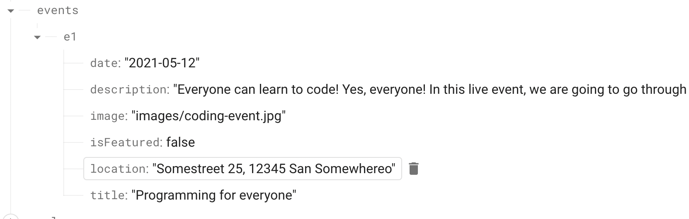

# Pre-Rendering演習1【Next.js】

### 何をするか
- SSG, SSR, CSRの復習・演習
- いつどれを使うべきか検討する

### 何を作るか
- 以前、演習で使用した[Event App](../2023-09/06_NextJS5.mdx)にプリレンダリングを実装する
- またダミーで作っていたデータ(ハードコード)をfirebaseのrealtimeDBに格納してデータフェッチングをする(imageに関してはローカルのパスを指定する。現実的でないが)


## Home Page
- ホームページを適切なのはSSGかSSRかCSRか
- ホームページは直接のトラフィック(サイトの入口)となる
1. SEOの影響をもろに受ける 
2. UXのためにレスポンス時間最小化したい
3. 通常、頻繁にデータの更新は行われない
- → ビルド時にデータとページが事前にほしい → SSG
```js filename="pages/index.js"
// import { getFeaturedEvents } from "../dummy-data";
import EventList from "../components/events/event-list";

function HomePage(props) {
  // const featuredEvents = getFeaturedEvents();
  const { featuredEvents } = props;

  return (
    <div>
      <EventList items={featuredEvents} />
    </div>
  );
}

export const getStaticProps = async () => {
  const response = await fetch(
    "https://<firebaseURL>/events.json"
  );
  const data = await response.json();
  
  const featuredEvents = [];
  
  for (const key in data) {
    if(data[key].isFeatured) {
      featuredEvents.push({
        id: key,
        title: data[key].title,
        description: data[key].description,
        date: data[key].date,
        image: data[key].image,
        location: data[key].location,
        isFeatured: data[key].isFeatured,
      });
    }
  }
  
  return {
    props: {
      featuredEvents: featuredEvents,
    },
    revalidate: 30 * 60  // 30 minutes
  };
};

export default HomePage;
```

- データフェッチングAPIは共通化したいため`/helpers/api-util.js`を作成する
- 上ではプロパティを全部書いていたが、スプレッド演算子をつかって記述するのが普通
```js filename="helpres/api-util.js" {12}
export async function getAllEvents() {
  const response = await fetch(
    "https://<firebaseURL>/events.json"
  );
  const data = await response.json();

  const allEvents = [];

  for (const key in data) {
    allEvents.push({
      id: key,
      ...data[key]
    });
  }

  return allEvents;
}

export async function getFeaturedEvents() {
  const allEvents = await getAllEvents();
  return allEvents.filter(event => event.isFeatured);
}
```

```js filename="pages/index.js"
import { getFeaturedEvents } from "../helpers/api-util";
import EventList from "../components/events/event-list";

function HomePage(props) {
  const { featuredEvents } = props;

  return (
    <div>
      <EventList items={featuredEvents} />
    </div>
  );
}

export const getStaticProps = async () => {
  const featuredEvents = await getFeaturedEvents();
  
  return {
    props: {
      featuredEvents: featuredEvents,
    },
    revalidate: 30 * 60  // 30 minutes
  };
};

export default HomePage;
```

## Event Detail Page(動的ページ)
- 詳細ページはSSG, SSR, CSRどれか？
- featuredEventsは`getStaticPaths`に指定したSSG、残りはSSRが望ましい(動的ページにはPathsが必ず必要)
<br/> ← featuredEventはホームページの一部(詳細)でありクローリングされるべきもの=SSGされるべきもの
<br/> ← また、featuredEventはユーザー固有のものでもないし、頻繁に更新されるデータでもない
- 詳細データの変更はすぐに反映させるべき、`reavlidate: 30`くらいが妥当

```js filename="helpres/api-util.js"
...
export async function getEventById(id) {
  const allEvents = await getAllEvents();
  return allEvents.find(event => event.id === id);
}
```

```js filename="pages/events/[eventId].js"
import { Fragment } from 'react';

import { getEventById } from '../../dummy-data';
import EventSummary from '../../components/event-detail/event-summary';
import EventLogistics from '../../components/event-detail/event-logistics';
import EventContent from '../../components/event-detail/event-content';
import ErrorAlert from '../../components/ui/error-alert';
import { getFeaturedEvents } from '../../helpers/api-util';

function EventDetailPage(props) {
  // const router = useRouter();

  // const eventId = router.query.eventId;
  // const event = getEventById(eventId);
const { event } = props;

  if (!event) {
    return (
      <ErrorAlert>
        <p>No event found!</p>
      </ErrorAlert>
    );
  }

  return (
    <Fragment>
      <EventSummary title={event.title} />
      <EventLogistics
        date={event.date}
        address={event.location}
        image={event.image}
        imageAlt={event.title}
      />
      <EventContent>
        <p>{event.description}</p>
      </EventContent>
    </Fragment>
  );
}

export const getStaticProps = async (context) => {
  const eventId = context.params.eventId;
  const event = await getEventById(eventId);

  if (!event) {
    return { notFound: true }
  }

  return {
    props: {
      event: event,
    },
    revalidate: 30, // 30sec
  }
}

export const getStaticPaths = async () => {
  const featuredEvents = await getFeaturedEvents();
  const ids = featuredEvents.map(event => event.id);
  const pathsWithPrams = ids.map(id => ({ params: {eventId: id}}));

  return {
    paths: pathsWithPrams,
    fallback: 'blocking',
  }
}

export default EventDetailPage;

```