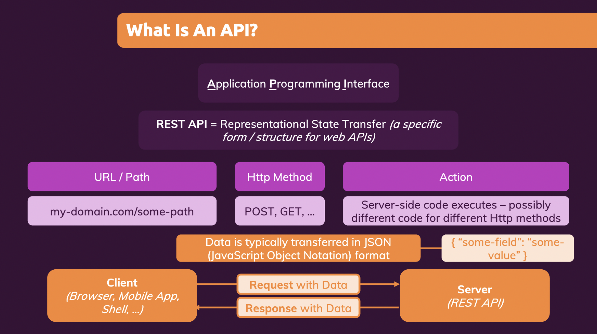

# Fullstack React1

## Introduction
バックエンドのコードを追加し、**フルスタックなReactApp**を作成していく

- API Routeとはなにか?
- API Routeを使ってみる
- リクエストとレスポンスを使いこなす


## What are "API Routes"?
- Webサイトを構築するのはHTMLだけでなく、データが必要
- サーバにデータを送り、サーバはでDBに問い合わせる
- DBは保存されたデータをサーバに送り返し、サーバはクライアントにデータを転送する
- ここで使われるのがAPI(Application Programing Interface)
- APIの種類はたくさんあるが、代表的なのはREST(Representational State Transfer) API = (URL + HttpMethod + Action)という特定の型を持つ形式
- 使用されるフォーマットはJSON(JavaScript Object Notation)が一般的




## Writing Our First API Route
- Next.jsは`/pages`フォルダ直下に`api`フォルダを作ることができる(必ず`api`というフォルダ名である必要がある)
- `pages/api/feedback.js`にページを作成するとエンドポイントが`<domain>/api/feedback`というURLになる
- apiフォルダ内ではJSXをexportしてはいけない。ハンドラー関数ををexportする
<br/>→ クライアントサイドではなく、サーバーサイドコードを実装するため
- ハンドラー関数はリクエストとレスポンスオブジェクトを引数にもつ

```js filename="pages/api/feedback.js"
function handler(req, res) {
  res.status(200).json({ message: 'This works!' });
}

export default handler
```

- この状態でブラウザに`http://localhost:3000/api/feedback`を入力するとJSONデータ見れる
- 検証→ネットワーク→feedbackと見ると
  - General
    - Request URL: http://localhost:3000/api/feedback
    - Request Method: GET
    - Status Code: 304 Not Modified
  - Response Headers
    - Content-Type: application/json; charset=utf-8
- `Content-Type: application/json`は特別なタイプのページであり、独自のサーバーサイドコードを実行し、独自のAPIを追加できたことを示している

