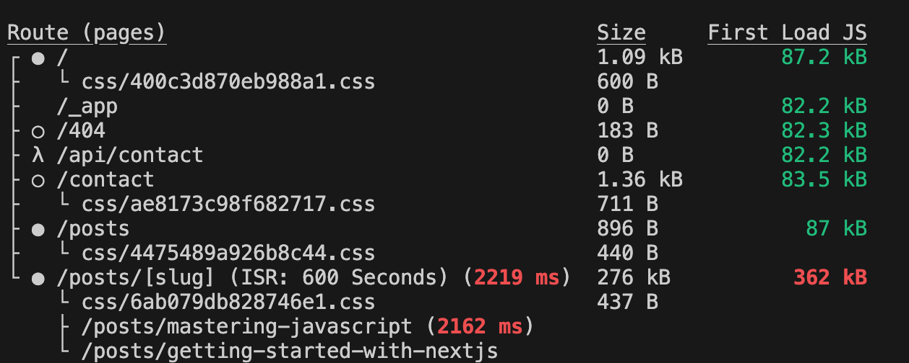

# Deploy Next.js4


## Running a Test Build & Reducing Code Size
- `npm run build`を実行した際、javascriptファイルが大きすぎるとを赤字になる場合がある
- このサイズはクライアントサイドの大きさを示している。（getStaticPropsなどはビルド時にしか実行されないためバンドルサイズに含めていない）


- 今回、サイズを圧迫しているのは以下のサードパーティライブラリ
```js filename="components/posts/post-detail/post-content.js"
import ReactMarkdown from 'react-markdown';
import Image from 'next/image';
import { Prism as SyntaxHighlighter } from 'react-syntax-highlighter';
import { atomDark } from 'react-syntax-highlighter/dist/cjs/styles/prism';

import PostHeader from './post-header';
import classes from './post-content.module.css';

...
```
↓ SyntaxHighlighterを軽量版にし、言語を絞ってimport・登録をする、atomDarkをジャストでimportする
```js {3-4, 6-7, 12-13} filename="components/posts/post-detail/post-content.js"
import ReactMarkdown from 'react-markdown';
import Image from 'next/image';
import { PrismLight as SyntaxHighlighter } from 'react-syntax-highlighter';
import atomDark from 'react-syntax-highlighter/dist/cjs/styles/prism/atom-dark';

import js from 'react-syntax-highlighter/dist/cjs/languages/prism/javascript'
import css from 'react-syntax-highlighter/dist/cjs/languages/prism/css'

import PostHeader from './post-header';
import classes from './post-content.module.css';

SyntaxHighlighter.registerLanguage('js', js);
SyntaxHighlighter.registerLanguage('css', css);
```
もう一度buildすると`362kb`→`135kb`になった