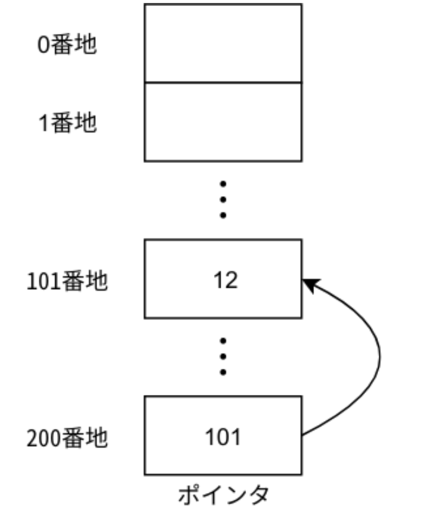

# ポインタ
## キーポイント

- プログラム上の変数はメモリ上に保存される
- メモリは巨大な配列のようなもの
- メモリ上の位置はアドレスという数値で識別される
- アドレスは配列の添字に対応
- ポインタはアドレスを扱う整数型
|操作|記法|
|---|---|
|ポインタの宣言|`型 *ポインタ;`|
|変数のアドレスを取得|`&変数`|
|ポインタの指す先へのアクセス(読み書き)|`*ポインタ`|
|ポインタそのものへのアクセス|`ポインタ`|
|ポインタ経由でのメンバアクセス|`ポインタ->メンバ`|

- ヒープ領域の確保
```cpp
型 *ポインタ1 = new 型;        // 1つ分の領域を確保
型 *ポインタ2 = new 型[n];     // 連続したn個分の領域を確保
```
- ヒープ領域のの解放
```cpp
delete ポインタ1;   //「new 型」で確保したときに返ってきたポインタ
delete[] ポインタ2; //「new 型[n]」で確保したときに返ってきたポインタ
```

# ポインタ
- ポインタはメモリを直接扱うために用いられる

## メモリ
- メモリというのはコンピュータに取り付けられている記憶装置(巨大な配列のようなものだと思ってください)
- 1バイトの単位はアドレス(番地)という数値によって識別される
- 8bit以上のサイズのデータを保存する場合は、8bit毎に分割して保存される
- 整数型は多数あったが、`int32_t`は32bitの整数型なので、メモリ上の32bit(4byte)を使用することになります。 `uint8_t`型は8bitの整数型なのでメモリ上の8bit(1byte)を使用します。

### sizeof演算子
- ある型がメモリ上の何バイトとなのかを知ることができる
```cpp
cout << sizeof(int32_t) << endl; // 4
cout << sizeof(int8_t) << endl;  // 1
```

## ポインタ
- メモリのアドレスは整数値で表すことができます
- この整数値を扱うための型がポインタ型であり、ポインタ型の変数をポインタといいます。
- 「101番地に12がある」そこを指すポインタが200番地にある


### ポインタの基本操作
- ポインタの指すアドレスに値を書き込む
- ポインタの指すアドレスから値を読み込む

```cpp showLineNumbers
#include <bits/stdc++.h>
using namespace std;

int main() {
  int x = 1;
  int *p;    // int8_t型に対するポインタを定義
  p = &x;    // xのアドレスで初期化
  *p = 2;    // ポインタが指すメモリへの書き込み
  cout << x << endl;  // 2

  int y;
  y = *p;  // ポインタ経由でxの値を読み取る
  cout << y << endl;  // 2
}
```
- `&変数`で変数のアドレスを得る
- `型 *ポインタ名`でポインタを定義
- `*ポインタ`でポインタの指すメモリ領域へのアクセス(書き込み・読み込み)

### ポインタの指す先のメンバアクセス
- ポインタがオブジェクトを指している場合に、`->`演算子を用いてメンバへアクセスすることができます。 `(*ポインタ).メンバ`と書くのと同じ意味ですが、よりシンプルに書くことができます。
```cpp showLineNumbers
#include <bits/stdc++.h>
using namespace std;

struct A {
  int data;
  void print() {
    cout << data << endl;
  }
};

int main() {
  A a = A { 1 };

  // オブジェクトaを指すポインタ
  A *p = &a;
  p->print();  // a.print()の呼び出し
  p->data = 2; // a.dataの書き換え
  p->print();
}
```
```
1
2
```

## ポインタの値
- ポインタ自体はメモリ上のアドレス(数値型)を保持する
- `*`をつけずにポインタ名だけ書けば、ポインタ自体にアクセス可能
```cpp
#include <bits/stdc++.h>
using namespace std;

int main() {
  uint8_t x = 1;

  uint8_t *p;
  p = &x;  // ポインタの内容をxのアドレスで初期化
  cout << p << endl;  // ポインタの内容を出力
}
```
```cpp filename="結果(例)"
0x7ffcf0483a6c // xが0x7ffcf0483a6c番地に割り当てられている
```
※ 16進数で表されている(先頭`0x`は16進数であることを明示している)

## アドレス値の比較
```cpp
#include <bits/stdc++.h>
using namespace std;

int main() {
  int x = 123;

  int *p = &x;  // xを指すポインタ
  int *q = &x;  // yを指すポインタ

  // アドレスの比較
  if (p == q) {
    cout << "p == q" << endl;
  } else {
    cout << "p != q" << endl;
  }
}
```

