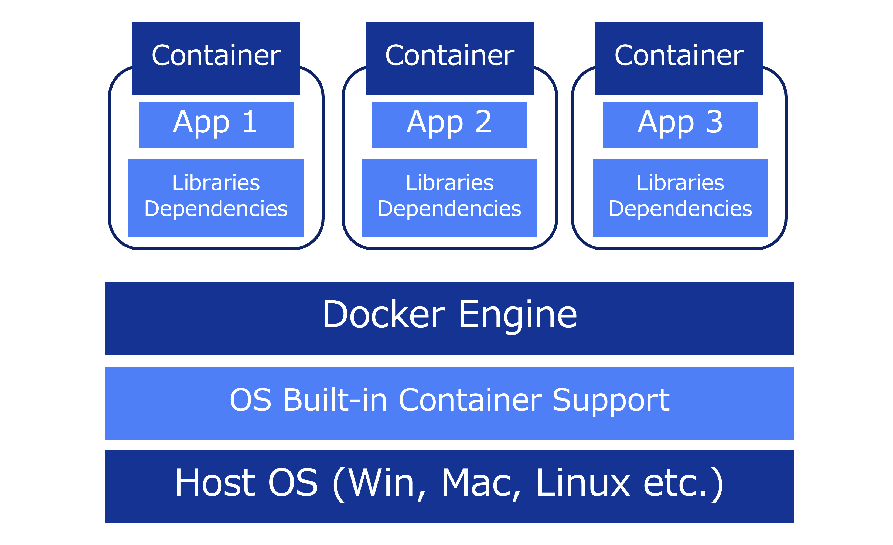

# docker
しばらく使っていなかったのと、Kubernetesを勉強したくなったので復習しようと思う

## Dockerとは何か?
- コンテナ技術である(コンテナを作成し、管理する)
### ソフトウェアにおけるコンテナとは
- 開発者が書いたソースコードとそれを実行するための依存関係やツールを指す
- コンテナ技術のコアは「ソースコードに加え、依存関係やツールを同じコンテナに突っ込み管理するというアイデア」

### メリット
- 異なる環境(ローカル・検証・本番など)でも、同じパージョンで再現することが可能(同じ動作と結果を得ることができる)

## なぜDockerを使うのか?
- 平たく言えば**何も考えずにソフトウェアを実行できる**ようになること
> ピクニックバスケットのイメージ
  バスケットを持ち運べばば、何も考えず、何も加えずピクニックに行くことができる
  必要であれば少し特殊な要望（例えばスープを食べたい）に対応した食器やスプーンを入れればいい
  ソフトウェアが動作する「場所」を持ち運べば、どこでも同じアプリケーションを実行可能

- Dockerは**コンテナ技術のデファクトスタンダード**である

## なぜコンテナなのか?
- ソフトウェアには再現性が求められるため
  - 同じプロジェクトでもチームや機関によってバージョンが異なることは少なくない
- コンテナはそのパッケージが*独立*・*標準化*されている
  - バージョンが異なるなら2つとも残しておいて、コンテナごと切り替えることが可能
  - 通常バージョンを揃えたい場合、ホストコンピュータにアンインストール・インストール作業が必要

### 仮想環境ではダメなのか?
仮想環境は、ホストOSの上に仮想OSをエミュレーションし、それをプロジェクトごとにカプセル化する技術。
一見、コンテナと同じように見えるが以下の問題点がある

1. 複数の仮想マシンを使用することによるオーバーヘッド(処理の本質ではない演算に費やされる計算量)
 →切り替えるたびに新しいコンピュータをセットアップしないといけない
 →開発・本番それぞれで同じようなセットアップをすることになる

2. CPU/メインメモリ/ストレージのリソースを食う
 →同じOSでも異なるOSとして扱い、OSの初期状態で必要なリソースが大量に被る(冗長)
 →パフォーマンス落ちる

- これらの問題をDockerは(完璧ではないが)解決することができる
 → コンテナの概念であれば、最小限のライブラリをそれぞれのコンテナで持つことになり冗長性を省ける

