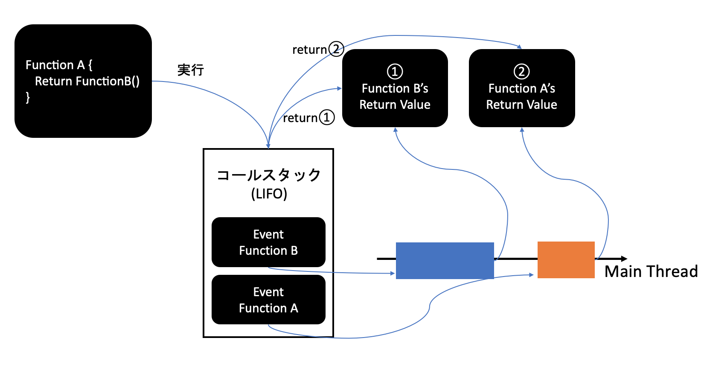

# 【Web】知っておきたいWebエンジニアリング各分野の基礎知見80
[zenn記事](https://zenn.dev/rio_dev/articles/c0da74ae28bdcd)

# 1. ブラウザでイベントループが起こる仕組みを説明せよ。 
> JavaScriptではシングルスレッドで動くが、非同期でのタスク実行をイベントループが可能にする。
関数は次々に呼び出され、コールスタックに追加されるが、実行が終わると一つ一つ取り出されている。ところが、たとえば一定時間後に関数を発火するAPIであるsetTimeoutを考えると、スタックに追加されるとすぐに時間計測を開始するととともに取り出される。一定時間の計測後、setTimeoutの関数はキューに入れられる。キューに入れられた関数は現在実行中のタスクが終わるとすぐに取り出され実行される。この仕組みをイベントループといい、非同期処理を行なっている。

### シングルスレッド(枝分かれしない処理・並行処理が行われない)
- JSのメインスレッドはコールスタック(LIFO)により管理される
  - 関数が呼び出されると、コールスタックに積み上がる
  - 関数がreturnされると、コールスタックから追い出される
  - 非同期処理はタスクをコールスタックから一時退避させることで、同時にタスクを処理させているように見せかけている
  - 実際にネットワーク通信や"他の環境"が処理を行うことで、効率的に並行処理を行っている

### タスクキュー
- 実行待ちの非同期処理の行列
- 非同期処理の実行順を管理
- キューはFIFO(First In First Out)=入ってきた順に実行される
- コールスタックと連携してコードの実行順を決定している
- イベントループがコールスタックを監視し、空になったときにタスクキューからタスクを持ってくる

# 2. TypeScriptが解決することを説明せよ。
- ①事前察知: コンパイルエラーによってJavaScriptではフォローできない、スクリプト実行前の未然検知を可能にする。
- ②開発体験向上: VSCodeなどのIDEと組み合わせることによって、型補完やエラーを表示させ開発体験を向上させることができる。
