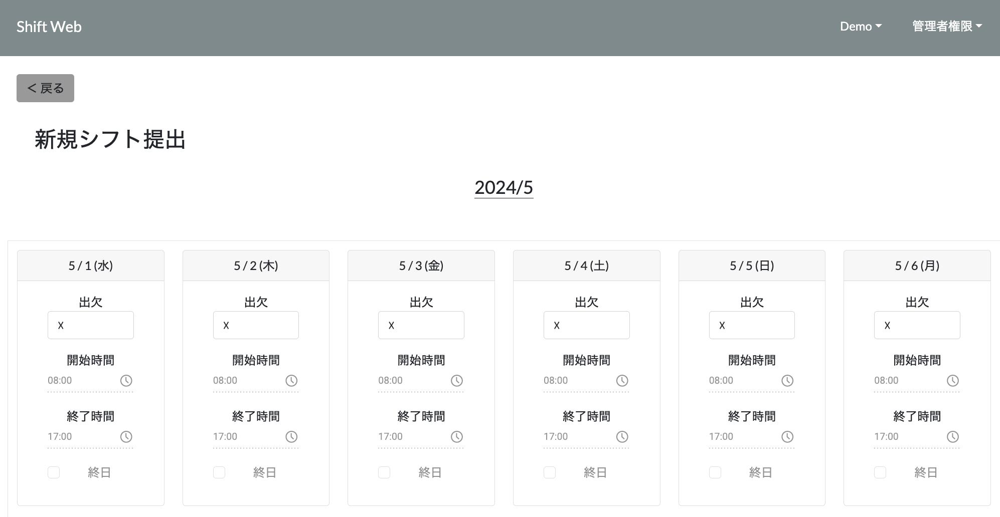
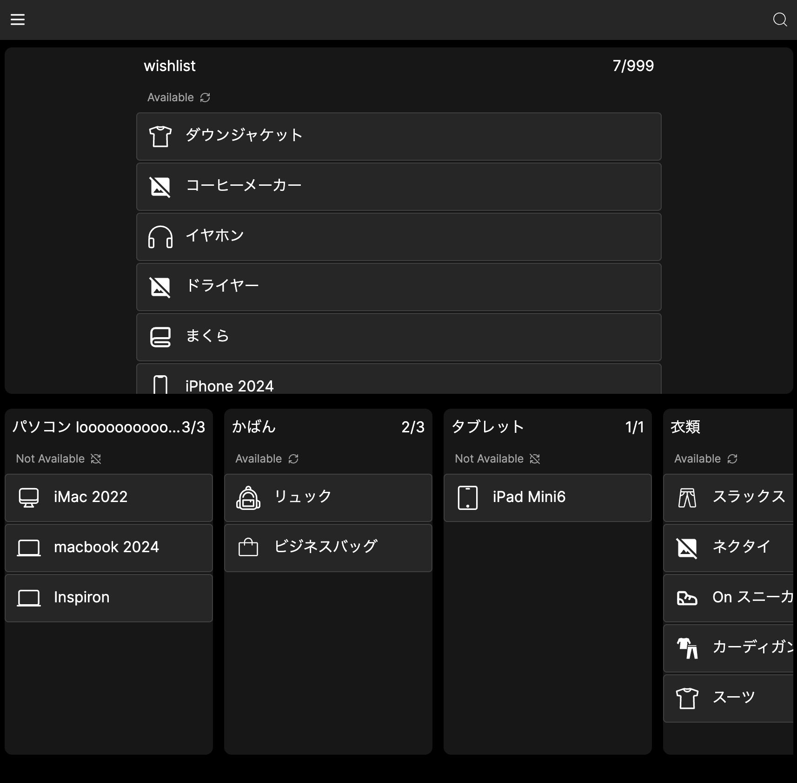

# 技術ブログ
Today I Learnedをできるだけ毎日投稿

---
## Works
### [シフト提出アプリ('20-'21)](https://django-vercel-three-khaki.vercel.app)

- バイト先が紙シフトで面倒だったため作ってみたくなったもの
- 使用技術([GitHub](https://github.com/Fumiya-Kito/django-vercel))
> React  
> Django  
> Django REST Framework  
> Simple JWT  
> Vercel(当初はHeroku)  
> Supabase(当初はRDS)  

### [1in1out('23-'24)](https://1in1out.vercel.app)

- モノを増やしたくないため、整理するためアプリを作成
- 使用技術([GitHub](https://github.com/Fumiya-Kito/1in1out))
> Next.js  
> Vercel  
> MongoDB Atlus  
